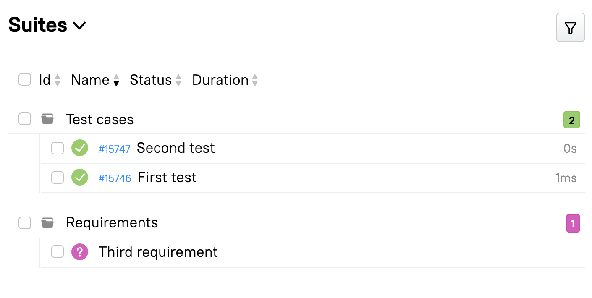

# Pytest Allure Spec Coverage

The pytest plugin aimed to display test coverage of the specs(requirements) in Allure



## Features

* Show your uncovered specs along with the test results
* Show your skipped specs in case if you run tests selectively
* Link your test results and their respective scenarios
* Add labels to your test results for the spec-related results view
* Lint your code for mismatching specs and tests


## Installation
```shell
pip install pytest-allure-spec-coverage
```

## How to use
Without additional arguments this plugin does nothing. 
You need to pass the collector type of your specs.
```shell
pytest --sc-type sphinx ./tests
```

Make sure that your tests are linked with your specs.
This plugin adds a new mark `scenario`. Mark your tests with a unique spec id depending on your collector type. 
```python
import pytest

@pytest.mark.scenario("something")
def test_something():
    pass
```

## Possible collectors
### sphinx
At the moment only sphinx collector implemented. 
It works with reStructuredText (.rst) files.
Value for the `scenario` mark - `sphinx-dir`-related path to the spec file. Extension is ignored
```
path/
  to/
    something.rst
```
```python
@pytest.mark.scenario("path/to/something")
```

Collector arguments:

`sphinx_dir` - where is placed your specs. 
All of the .rst files in the directory and sub-folders will be perceived as specs.
The only exception - index.rst files. It will be used as the title of directories.

`spec_endpoint` - optionally endpoint where is hosted your sphinx specs.

`default_branch` - change it if your default repository branch differs from `master`. 
The current branch gets from env variable `BRANCH_NAME` and is used to build the correct link to spec.

### Your custom collector
You can easily implement your collector and register it for the plugin.
See `Collector` class for available methods.

```python
# conftest.py
from pytest_allure_spec_coverage.models.collector import Collector
from pytest_allure_spec_coverage.plugin import CollectorsMapping

class YourOwnCollector(Collector):
    ...

def pytest_register_spec_collectors(collectors: CollectorsMapping) -> None:
    """Register your own spec collector"""

    collectors["yourowncollector"] = YourOwnCollector
```
That's all. Now you can choose it in your tests
```shell
pytest --sc-type yourowncollector ./tests
```


## How to use spec collector as a linter
For the linter mode, we have the following options.

`--sc-only` - enable linter mode. 
If spec coverage percent is lower than `--sc-target` value, you get a non-zero exit code and error message.

`--sc-target` - target percent for the spec coverage. The default target is 100% - uncovered specs are not allowed.

If you use linter mode, tests won't start anyway. It's just the start collection stage and exit with zero or non-zero exit code. 
It is convenient to use in your CI.

## Reporting arguments
You can pass `allure_labels` setting with labels for building spec structure in test results.
Recommended value for the [Allure2](https://github.com/allure-framework/allure2) is:
```ini
# pytest.ini
[pytest]
allure_labels =
    epic
    feature
    story
```
But you can use your custom labels if you needed.

## Note
If you use Allure TestOps, spec coverage will be disabled in case of test run from TestOps, like re-run in existing launch


## If you want to contribute
### Pre-commit hook

We are using black, pylint, and pre-commit to care about code formatting and linting.

So you have to install pre-commit hook before you do something with code.

``` sh
pip install pre-commit # Or do it with your preferred way to install pip packages
pre-commit install
```

After this, you will see the invocation of black and pylint on every commit.

### Run tests

To run tests, execute within project root:

```bash
pip install -e .
pytest src/pytest_allure_spec_coverage --doctest-modules --alluredir tests/allure-results
pytest -s -v --showlocals --alluredir tests/allure-results
```
